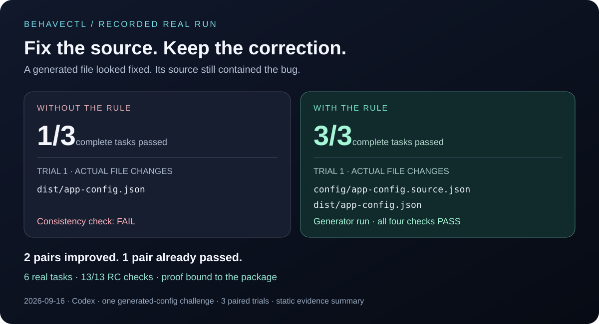

# Behavectl

**Git for AI behavior.** Test a correction before your agent keeps it.

Turn repeated corrections into reviewable rules. Compare real agent behavior
before and after, inspect the evidence, then promote or roll back the change.
Local-first · zero runtime dependencies · human-controlled promotion.

[Download alpha](https://github.com/momo-hub-learn/behavectl/releases/tag/v0.1.0-alpha.2) · [Quickstart](docs/quickstart.md) · [Contribute](CONTRIBUTING.md)

[](https://github.com/momo-hub-learn/behavectl/releases/download/v0.1.0-alpha.1/behavectl-evidence-preview.mp4)

**[Watch the 30-second evidence replay](https://github.com/momo-hub-learn/behavectl/releases/download/v0.1.0-alpha.1/behavectl-evidence-preview.mp4)** · Retained Codex evidence, not live screen footage.

Try the 30-second tour from a source checkout:

```bash
node src/cli/behavectl.mjs demo
```

The tour is a **SIMULATION**: no account, no model calls, no active rule changes.

## Why use it?

“Remember this next time” gives you a rule. Behavectl helps you decide whether
that rule actually works:

- **Review** the proposed correction and what it should change.
- **Verify** it with real before/after trials in isolated workspaces.
- **Inspect** commands, file changes, and a version-bound **Behavior Proof** in Studio.
- **Promote** the verified rule explicitly; roll it back when needed.

## A real result



Codex changed a generated config but left its source stale. The correction:
**edit the canonical source, then regenerate the output.**

Across three paired trials, complete-task passes improved **1/3 → 3/3**.
Two pairs improved; one already passed. All 13 release-candidate checks passed.
This covers **one challenge on Codex**, not a general benchmark.
[Certification and artifact fingerprint](LAUNCH_CHECKLIST.md).

The retained **alpha.1** package is Codex-certified. **Alpha.2** fixes Studio onboarding
and passes deterministic checks; it has no new real-agent certification.
CodeBuddy Code and Claude Code adapters are **not certified**.

## Get started

Requires **Node.js 20+ and Git**. Download the `.tgz` from the
[GitHub release](https://github.com/momo-hub-learn/behavectl/releases/tag/v0.1.0-alpha.2),
check its SHA-256 against the release notes, then run from the download directory:

```bash
npm install --prefix ./local-runtime --ignore-scripts --no-audit --no-fund ./behavectl-0.1.0-alpha.2.tgz
export PATH="$PWD/local-runtime/node_modules/.bin:$PATH"
behavectl demo create --agents codex
cd behavectl-killer-demo
behavectl studio
```

Open the URL printed by Studio. No npm account is needed; npm registry
publication is deferred. [Windows and your own project →](docs/quickstart.md)

Opening Studio makes no model calls. Real verification requires an authenticated
agent and an explicit start, and may incur model costs. Promotion is a separate
decision; simulations cannot authorize it.

## Documentation

- [Quickstart and daily workflow](docs/quickstart.md)
- [Trust model](docs/trust-model.md) · [Architecture](docs/architecture.md)
- [Use it inside your coding agent](docs/phase6i-agent-native-mode.md)
- [Build an adapter](docs/adapter-guide.md) · [Behavior CI](docs/phase6c-behavior-ci.md)
- [Roadmap](ROADMAP.md) · [Security](SECURITY.md) · [License](LICENSE)
